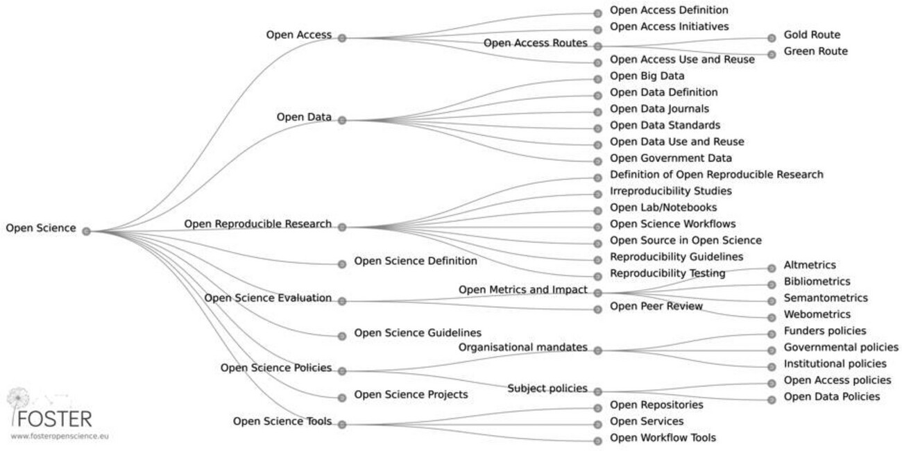
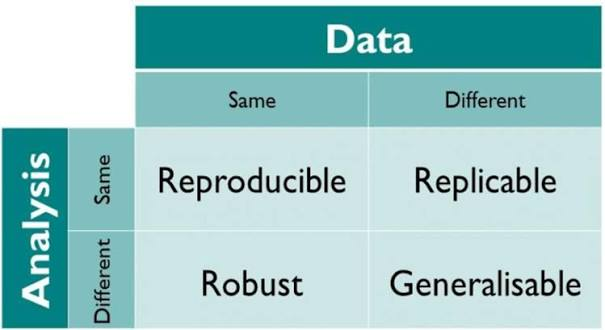
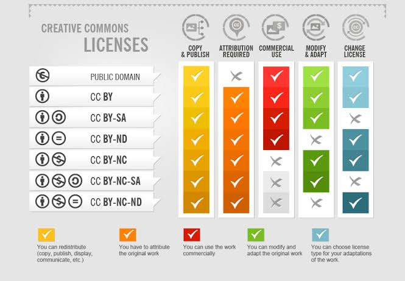
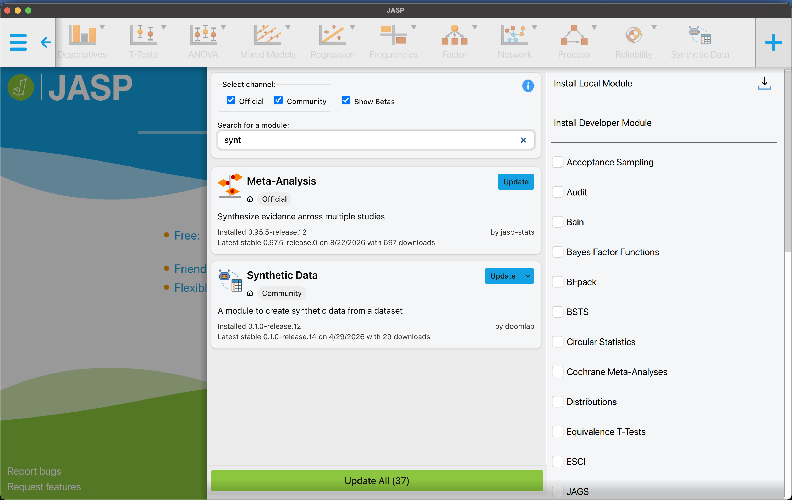
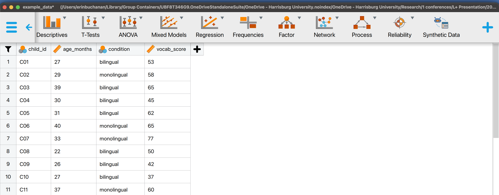
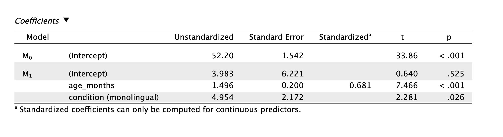
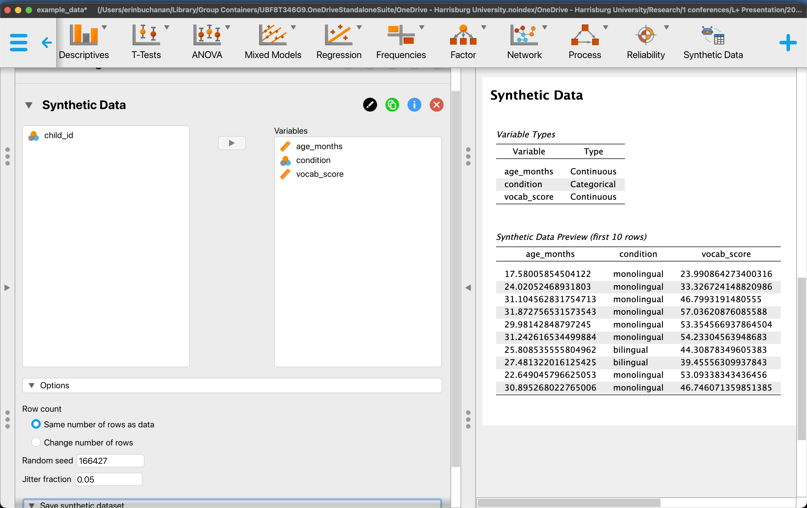
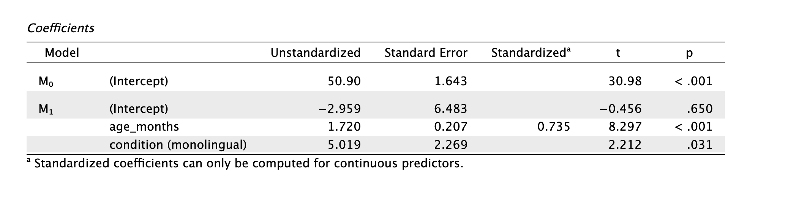

## Overview  {.smaller}

- Open science practices are increasingly expected in the social and behavioral sciences
- Developmental research has adopted them more slowly
  - Descriptive rather than confirmatory \*\*
- Research often involves special populations, while open science norms were developed around adult populations
- We shall examine open science practices across a full range of options!
- @gennetian2022

## Structure  {.smaller}

1.  Open science foundations
2.  The full scope of openness: materials, code, access, translation
3.  Repositories, licenses, and infrastructure
4.  Ethics and research with children
5.  Synthetic data generation in R and JASP
6.  Questions, ideas, and brainstorming

## Open Science Foundations  {.smaller}

Open science is often reduced to "sharing data," but the broader set of practices includes:

- Preregistration and registered reports
- Open materials (stimuli, protocols, coding manuals, translated instruments)
- Open and reproducible analysis code
- Open access publication and preprints
- Replication and data reuse across labs
- @munafò2017; @al-hoorie2024; @marsden2018; @marsden2023

## Open Science Foundations  {.smaller}



## Barriers to Open Science   {.smaller}

- Descriptive/qualitative research doesn't seem to match
- Some designs do not fit preregistration templates
- Small, hard-won samples make replication difficult
- Identifiability of participants complicates data sharing
- A call to change the toolkits
- @kosie2024

## Open Science Encourages Error Correction  {.smaller}

- Preregistration constrains post hoc flexibility in analytic decisions
- Shared materials let other labs build directly on an existing paradigm rather than reinventing it
- Reproducible code catches errors before, not after, publication
- Cross-lab replication is often the only way to separate a real effects from a sampling or site-specific artifact
- @strand2025

## Full Scope: Preregistration  {.smaller}

- States hypotheses, sample size rationale, and planned analyses before data collection
- Registered Reports go a step further: peer review of the design happens before results exist, and publication does not depend on the outcome
- Templates exist for both experimental designs (e.g., AsPredicted, OSF) and, increasingly, for longitudinal and descriptive work (Kosie & Lew-Williams, 2024)
- Deviations from a preregistration are not failures; they should simply be reported as deviations
- @hobson2019; @nosek2014; @d.chambers2014

## Full Scope: Open Materials  {.smaller}

- Stimuli, coding manuals, and experiment scripts allow direct reuse and extension by other labs
- For cross-linguistic work, this includes translated and adapted versions of an instrument, not only the original-language materials
- Documentation of the translation and adaptation process (who translated, back-translation procedures, piloting) is itself a research output worth sharing
- Without this documentation, a "translated" instrument in another lab's hands may not be measuring the same construct
- @masuzzo2017 \*\*

## Full Scope: Open and Reproducible Code  {.smaller}

- Analysis scripts should run end to end on a **saved** environment, ideally producing the paper's reported numbers and figures directly
- Version control (Git/GitHub) supports both collaboration and a citable, time-stamped record of the analysis – especially if you sync with Zenodo!
- Code and data can carry different licenses and be shared even when the underlying data cannot (see next section)
- @suchow2026; @siraji2024; @foll2026; @weberpals2024
- BTSCon Plug! <https://bigteamscienceconference.github.io/>

## Full Scope: Open Access and Preprints  {.smaller}

- Preprint servers allow a manuscript to be public before or during peer review
- Useful for establishing priority and for getting feedback from a wider, more international audience than a single review process reaches \*\*
- Complements, rather than replaces, formal open-access publication
- @moshontz2021; @sarabipour2019; @soderberg2020

## Full Scope: Replication and Reuse  {.smaller}



- Check out the Turing Way!

- Large scale studies and collaborative networks allow us to do this cool work easier

- @plesser2018; @baumgartner2023; @forscher2020; @koch2016

## Full Scope: Cross Cultural Considerations   {.smaller}

- Most open science norms were developed within WEIRD contexts

- Applying them unreflectively across a cross-cultural or multi-site collaboration can reproduce inequities

- Ethical review standards, definitions of consent, and norms around family involvement in decision-making vary by country and community

- Data-sharing expectations from funders are frequently set in high-income countries and may not fit the constraints of every site

- @syed; @srivastava

## Full Scope: Cross Cultural Considerations  {.smaller}

- Ethical approval should reflect local guidelines at each site, not only the lead institution's IRB

- Local researchers are often better positioned to navigate informed consent, including family involvement and protection against coercion

- Slower, more participatory timelines can conflict with publication incentives, which reward fast turnaround

- @weinstein2026

## Full Scope: Cross Cultural Considerations  {.smaller}

- Translated materials need local review, not just linguistic back-translation, to confirm they carry the same meaning and are ethically appropriate in context
- Authorship and credit for local collaborators and research assistants should be agreed on before data collection, particularly in large cross-linguistic networks
- Data-sharing agreements should be negotiated per site where local norms or regulations differ, rather than defaulting to a single blanket policy

## Infrastructure: Where OSF Fits Now   {.smaller}

- COS announcement in August 2026 about no new projects

- Registration and pre-print services will still be available

- <https://www.cos.io/osf-changes>

## Infrastructure: General-Purpose Repositories  {.smaller}

- **Zenodo**: free, operated by CERN/OpenAIRE, up to 50 GB per dataset, DOI issued, integrates directly with GitHub for code archiving
- **Figshare**: free up to 20 GB, paid tiers for larger deposits, strong citation and versioning support
- **Harvard Dataverse**: free, open-source platform, strongly encourages CC0 for public datasets, good institutional metadata support
- **Research Box:** a newer service that integrates As Predicted, As Collected, and allows for a cool grid display of research, synced with Zenodo for DOIs.
- **TROLLing** (the Tromsø Repository of Language and Linguistics): curators provide guidance on structuring and documenting a linguistic dataset, help you make items FAIR
- *note: there are more!*

## Licensing: Terminology  {.smaller}

- **CC0** (public domain dedication): no rights reserved; the most permissive option, and the default recommendation from Dataverse for public datasets
- **CC BY**: reuse permitted with attribution; common default for shared materials and stimuli
- **CC BY-NC / CC BY-SA / CC BY-ND**: add restrictions (non-commercial, share-alike, no-derivatives) that can limit reuse and should be chosen deliberately, not by default
- A license should be chosen at deposit time, not left blank; an unlicensed dataset is not legally reusable even if it is technically downloadable
- Recommended for data, materials
- <https://creativecommons.org/cc-licenses/>

## Licensing: Terminology  {.smaller}



## Ethics: Openness Is Not Automatically Ethical  {.smaller}

Standard open data norms assume participants who can consent for themselves. Research with children complicates this at nearly every stage:

- Parental consent does not resolve every ethical question a study raises
- Assent, where developmentally appropriate, should be revisited as children grow older
- Video and audio recordings are, by nature, difficult to fully de-identify
- @marschik2023; @patrinos2022; @begumali2024; @oakley2025

## Ethics: In the Data Plan   {.smaller}

- Decide the scope of intended data sharing before IRB submission, not after
- Write consent language that explicitly names future reuse and sharing, rather than leaving it implicit
- Separate what can be public (stimuli, code, aggregate results) from what must remain restricted (raw recordings, identifiable transcripts)
- Document these decisions so that future collaborators inherit the reasoning, not just the constraints

## Tutorial(ish): Synthetic Data Generation  {.smaller}

- Synthetic data offers a way to balance openness and confidentiality

- It preserves the statistical structure of a dataset without exposing identifiable records

  - Sharing realistic data structures without exposing real children's data

  - Piloting and preregistering analysis pipelines before data collection is complete

  - Teaching statistical methods without needing access to restricted datasets

- @nowok2016; @jordon

## Synthetic Data in R  {.smaller}

The `synthpop` package is a widely used implementation, alongside `simstudy` and `faux`. The general approach:

1.  Characterize the structure (distributions, correlations) of the real dataset
2.  Generate synthetic records that preserve that structure without corresponding to real individuals
3.  Validate by comparing summary statistics and model output across real and synthetic versions

- @nowok2016; @debruine2021; @goldfeld2026

## Synthetic Data in R: Setup  {.smaller}

```{r}
#| label: setup
# install.packages(c("faux", "synthpop"))
library(faux)
library(synthpop)
```

## Synthetic Data in R: "Real" Data  {.smaller}

Simulate a small study: vocabulary score predicted by age (months) and condition (bilingual vs. monolingual), with some correlation between age and vocabulary.

```{r}
#| label: real-data
set.seed(123)

n <- 60

real_data <- data.frame(
  child_id   = paste0("C", sprintf("%02d", 1:n)),
  age_months = round(rnorm(n, mean = 30, sd = 6)),
  condition  = sample(c("bilingual", "monolingual"), n, replace = TRUE),
  vocab_score = NA
)

# Vocabulary score depends on age and condition, plus noise
real_data$vocab_score <- with(
  real_data,
  round(10 + 1.5 * age_months +
          ifelse(condition == "bilingual", -5, 0) +
          rnorm(n, mean = 0, sd = 8))
)

head(real_data)
summary(real_data)
```

## Synthetic Data in R: `synthpop`  {.smaller}

`synthpop` learns the joint structure of the real dataset, including relationships between variables, and generates new records that preserve that structure without corresponding to real individuals. `child_id` is dropped first since it is just an identifier.

```{r}
#| label: synthpop-generate
synth_input <- real_data[, c("age_months", "condition", "vocab_score")]

synth_result <- syn(synth_input, seed = 123)

synth_data <- synth_result$syn
head(synth_data)
```

## Synthetic Data in R: `synthpop`  {.smaller}

```{r}
#| label: synthpop-compare
summary(synth_input)
summary(synth_data)

# Compare a simple model fit on real vs. synthetic data
lm(vocab_score ~ age_months + condition, data = synth_input)
lm(vocab_score ~ age_months + condition, data = synth_data)
```

## Synthetic Data in R: `faux`  {.smaller}

`faux::sim_df()` takes an existing data frame and generates a new synthetic dataset that preserves its means, standard deviations, and correlations among numeric variables — the same basic goal as `synthpop`, but using `faux`'s simpler multivariate-normal-based approach.

```{r}
#| label: faux-generate
faux_synth <- faux::sim_df(
  real_data[, c("condition", "age_months", "vocab_score")],
  n = n,
  between = "condition"
)

head(faux_synth)
summary(faux_synth)
```

## Synthetic Data in R: `faux`  {.smaller}

```{r}
#| label: faux-compare
# Correlation structure, real vs. synthetic
cor(real_data[, c("age_months", "vocab_score")])
cor(faux_synth[, c("age_months", "vocab_score")])

# Simple model fit, real vs. synthetic
lm(vocab_score ~ age_months + condition, data = real_data)
lm(vocab_score ~ age_months + condition, data = faux_synth)
```

`sim_design()` remains useful separately, for the case where there is no existing dataset yet and a study is being simulated from specified effect sizes ahead of data collection (e.g., for a power analysis or preregistration).

## Synthetic Data in JASP  {.smaller}

- JASP supports simulating data for teaching and pipeline testing without requiring R syntax
- Useful for collaborators who are less comfortable in code but need to evaluate an analysis plan

## Synthetic Data in JASP  {.smaller}

- Be sure to click community!



## Synthetic Data in JASP  {.smaller}



## Synthetic Data in JASP  {.smaller}



## Synthetic Data in JASP  {.smaller}



## Synthetic Data in JASP  {.smaller}



## **What You've Learned**  {.smaller}

- Open science is a full set of practices, not just data sharing: preregistration, materials, code, access, and replication all count

<!-- -->

- Where materials are deposited and how they're licensed shapes whether they can actually be reused

- OSF's role is changing; Zenodo, Figshare, Dataverse, and TROLLing are the practical landing spots for active projects going forward

- Cross-cultural and multi-site collaborations need locally embedded practices, not a single norm applied everywhere

- Synthetic data (via `synthpop` or `faux`) offers a way to prototype, teach, and preregister analysis pipelines without exposing real data

## References   {.smaller}
